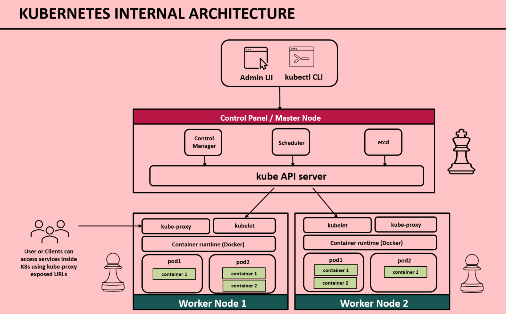

# KUBERNETES & INSTALLATION

## Kubernetes, Kubectl, and Kubeadm INSTALLATION via Docker Desktop on Windows

Follow these steps to install Kubernetes, `kubectl`, and optionally `kubeadm` via Docker Desktop on Windows.

## Prerequisites

- Windows 10/11 (64-bit) or Windows Server 2019/2022
- WSL 2 enabled (Windows Subsystem for Linux)

## Steps

### 1. Install Docker Desktop for Windows

- Download Docker Desktop from [Docker Desktop for Windows](https://www.docker.com/products/docker-desktop).
- Run the installer and follow the on-screen instructions.
- During installation, ensure that **"Install Kubernetes"** is selected.

### 2. Enable Kubernetes in Docker Desktop

1. Open **Docker Desktop**.
2. Click on the **Settings (gear icon)** in the top-right corner.
3. Navigate to the **Kubernetes** tab.
4. Check the box labeled **Enable Kubernetes**.
5. Click **Apply & Restart** to start Kubernetes.

### 3. Verify Installation of Kubernetes and Kubectl

- Open **PowerShell** or **Command Prompt**.
- Run the following commands to verify the installation:

  ```bash
  kubectl version --client    # To check kubectl version
  kubectl cluster-info        # To check Kubernetes cluster info
  ```

### 4. Verify Installation of minikube

- Open **PowerShell**.
- Run the following commands to verify the installation:

  ```bash
        # download minikube in window

        New-Item -Path 'c:\' -Name 'minikube' -ItemType Directory -Force
        Invoke-WebRequest -OutFile 'c:\minikube\minikube.exe' -Uri 'https://github.com/kubernetes/minikube/releases/latest/download/minikube-windows-amd64.exe' -UseBasicParsing


        # set path using run as admin in powershell
        $oldPath = [Environment]::GetEnvironmentVariable('Path', [EnvironmentVariableTarget]::Machine)
        if ($oldPath.Split(';') -inotcontains 'C:\minikube'){
        [Environment]::SetEnvironmentVariable('Path', $('{0};C:\minikube' -f $oldPath), [EnvironmentVariableTarget]::Machine)
        }

  ```

### 5. Verify Installation of Kubeadm

- kubeadm is typically not required for local development with Docker Desktop, as Docker Desktop manages the Kubernetes cluster for you. However, if you need kubeadm, follow these steps:

- Download the kubeadm binary from the Kubernetes GitHub Releases.

- Extract the kubeadm binary and move it to a directory included in your system's PATH.

- Example steps:

  1. Download the appropriate kubeadm binary for your system.
  2. Extract the binary and move it to a folder (e.g., C:\kube-tools).
  3. Add the folder to your system's PATH:
  4. Right-click on This PC > Properties > Advanced system settings.
  5. Click Environment Variables > under System variables, find the Path variable.
  6. Click Edit and add your folder (e.g., C:\kube-tools) to the list.

  ```bash
  kubeadm version    # To check kubectl version
  ```

# K8 ARCHITECTURE



# [DEVOPS TOOLS](https://landscape.cncf.io/)

1.  LENS 5.3 IDE Install for K8

2.  MANAKLE by KUBESHOP for MANIFEST file when getting more

3.  TELEPORT
